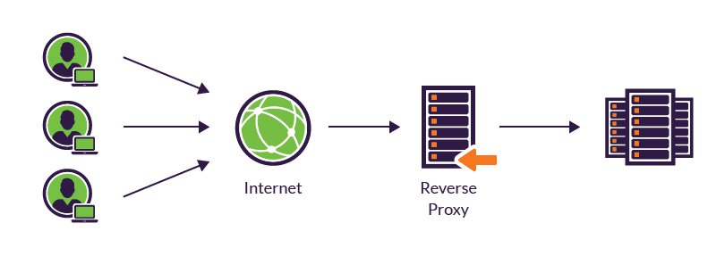

# Tag 3
## Vorteile Vagrant
---

 Vagrant start der VM geht schneller, kann einfacher zügeln und in kürzester Zeit kann man es wieder aufsetzen ohne eine Maschine zu reaprieren, bessere qualität und skalierbarkeit, alle den gleichen Zustand 

## Agenda Tag 3:
#### Firewall / proxy
---
## Reverse Proxy

### Was ist eine reverse proxy

Eine reverse proxy ist ein Server, welche hinter einer Firewall steht und die
einkommenden Clients dann zu den bestimmten backend Server weiterleitet

### Wobei hilft eine reverse proxy

--- 

## Vagrant ssh zugriff

